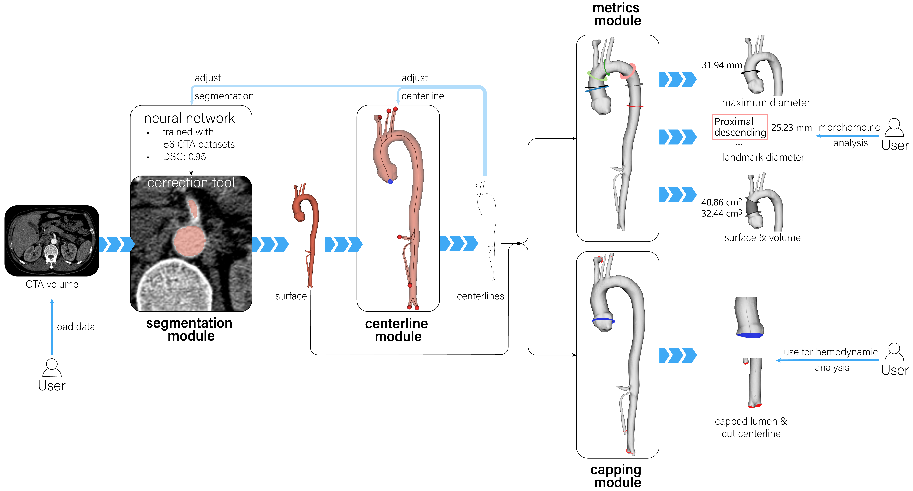

# Aorta Framework

A fully integrated pipeline for aortic surface and model extraction, centerline computation, capping and visual analysis. 


## Data 
The volume data should be stored in nrrd format, which can be used directly or in DICOM/nifti format, which can be converted inside the tool. Each case has to be stored in a separate directory, the volume file has to start with the name of that directory. 

## Files
- `modules` All module widgets and associated classes (for prediction, preprocessing and interaction) are located here. 
    - `CappingModule.py` Module to cap lumen and centerline. 
    - `CenterlineModule.py` Module for centerline computation.
    - `Interactors.py` Image and 3D interactors. 
    - `MetricsModule.py` Module for interactive diameter measurement and landmark determination.
    - `Predictor.py` CNN for label prediction. 
    - `Runet.py` Setup of CNN for label prediction. 
    - `SegmentationModule.py` Module for segmenting CTA images and manual correction of predictions. 
- `AortaFramework.py` Main application, run this for execution. 
- `defaults.py` Global constants (e.g. colors)
- `mainwindow_ui.py` Main UI setup. 


## Setup
### Pretrained Model Weights 
To generate preditions for the aorta segmentation, the model weights have to be downloaded from the Assets section of the *"paper release"*:

[`best_model497`](https://github.com/FvDeylen/AortaFramework/releases/download/paper_release/best_model497)

After downloading, place the file into the project root directory.

### Dependencies

- Python 3.10
- numpy 1.24
- pyqt 6.7 (GUI)
- vtk 9.2.6 (rendering)
- vmtk 1.5 (centerline computation)
- pytorch 2.3 (segmentation prediction)
- pydicom 2.4 (read in DICOM data)
- nibabel 5.2 (read in niifti data)
- pynrrd 1.0 (write nrrd files)
- scikit-image 0.23 (posptocessing of prediction)

### Setup with Anaconda

With a CUDA-enabled GPU:
```bash
 conda create -n AortaFramework python=3.10 pytorch torchvision torchaudio pytorch-cuda=11.7 -c pytorch -c nvidia 
```

> **or** install Pytorch for CPU only: 
>
>```bash
>conda create -n AortaFramework python=3.10 pytorch torchvision torchaudio cpuonly -c pytorch  
>```
>See also the [PyTorch](https://pytorch.org/get-started/locally/) installation instructions.

Activate the environment and install the remaining packages:   
```bash
conda activate AortaFramework
conda install -c conda-forge vtk=9.2.6 vmtk pydicom pynrrd 
pip install pyqt6
pip install nibabel
pip install pandas 
pip install scikit-image
```

The main application can be run and modified now. 

## First Steps 
1. Start the application with (environment has to be active)
```bash
python AortaFramework.py
```
2. Navigate to your patient database and set it with `File -> Set Working Directory`. 
3. All existing cases can be seen in the data inspector module. Data can be loaded by either double-clicking on the case or by `Load Selected Patient`
-> If you want to import a new CTA data either use `File -> Load New DICOM` (should be axially resolved CTA) to choose the folder containing a DICOM series or `File -> Load New nifti` to choose a compressed nifti file. The data will be loaded and saved into a new directory. 
4. The pipeline can now be used on the new data. 

## Implementing Extensions
Extension modules that are a subclass of [QWidget](https://doc.qt.io/qtforpython-6/PySide6/QtWidgets/QWidget.html#PySide6.QtWidgets.QWidget) can be integrated directly (see existing modules).

To integrate into the internal pipeline communication add Qt's signal/slot mechanism: 
 - Implement a `loadPatient(active_patient_dict)` method that reads in all required files if they are present in the new module. The `(active_patient_dict)` is supplied by the application when a new patient is loaded. It contains all file paths for the active patient. If new files are generated by the module extend the dictionary keys and new file signatures in `AortaFramework.py -> setWorking(dir)`.
 - When data is edited in the new module, the `data_modified` signal should be triggered to inform the application about the changes. That enables the user to save/discard the changes and prevents data loss by disabling the other modules and loading in new data. 
 - Implement a `save()` method to save the modifications and a `discard()` method to reset them. 
 - Check/modify methods in the application called `newSegmentation(), newModels() ...`, which are called when data is saved inside of Modules and triggers the internal data propagation in other modules. 
 - To add the new module to the UI, extend `mainwindow_ui.py` and add the module to the `module_stack` in `AortaFramework.py`. 